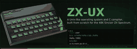

<!-- Copyright (c) 2026 Supratim Sanyal of SANYALnet Labs. -->
<!-- Proprietary rights reserved except as expressly licensed herein. -->
<!-- -->
<!-- ZX-UX Sinclair ZX Spectrum Unix -->
<!-- This file is governed by the SANYALnet Labs Non-Commercial License in the -->
<!-- root LICENSE file. Non-Commercial use is permitted; Commercial Use and use -->
<!-- for AI/ML model training are prohibited unless separately authorized. -->
<!-- -->
<!-- Attribution is required: "Based on original work by Supratim Sanyal of -->
<!-- SANYALnet Labs." See LICENSE for full terms, warranty disclaimer, termination, -->
<!-- patent, trademark, and governing-law provisions. -->

# ZX-UX — Unix for the Sinclair ZX Spectrum 48K

<p align="center">
  
</p>

<h1 align="center">🚧 COMING SOON</h1>

**ZX-UX is a Unix-like operating system and native C development environment being built from scratch for the original, unexpanded Sinclair ZX Spectrum 48K.**

It targets the real 1982 machine:

**one ~3.5 MHz Z80A · 48 KiB RAM · 16 KiB ROM · cassette storage · no MMU · no banked RAM**

ZX-UX is not a Unix port. It is a small Unix-inspired operating environment designed specifically around the limits of the original **ZX Spectrum 48K**.

## Unix ideas in 48K

The Z80A is an 8-bit processor with a 16-bit address space, 16-bit register pairs and useful 16-bit operations. That gives ZX-UX a little more room to manoeuvre than a simpler 8-bit CPU, but it remains very much a 1982 machine.

ZX-UX reserves just **8 KiB for its resident kernel** at the top of RAM.

That leaves roughly **40 KiB outside the kernel** for the Spectrum display and system areas, stored objects, program data, process stacks and user programs.

Every byte has employment.

## The ZX-UX kernel

The Version 1 kernel is designed to provide:

- cooperative multitasking
- processes and process state
- task switching
- sleep and wake services
- pipes
- standard input and output
- file-like handles
- a compact system-call interface
- terminal and keyboard services
- cassette-backed persistence
- graphics and User Defined Graphics (UDG) services
- ZX Spectrum-compatible sound and `beep`
- software wall-clock and timing services
- Z80 IM 2 interrupt handling
- compact compression for eligible inactive stored objects
- one shared physical address space

ZX-UX deliberately does **not** pretend the Spectrum has memory protection, virtual memory, demand paging, per-process address spaces, an MMU, or hidden RAM expansion.

## A complete Spectrum-native development environment

The goal is more than a kernel prompt. ZX-UX Version 1 is designed as a usable Unix-like programming environment running on the Spectrum itself, including:

- `sh` command shell with pipelines, I/O redirection and environment variables
- `/bin`, `/dev`, `/etc`, `/home` and `/tmp`
- 64-column × 24-row software terminal with 32-column fallback
- `vi` text editor
- Z80 assembler, object format, linker and loader
- native executable format
- **C48 C compiler**
- graphics, colour and UDG APIs
- keyboard and cassette save/load services
- sound and `beep`
- `ls`, `mem`, `ps`, `date`, `cron`, `crontab`, `man`, `stty`, `pack` and `unpack`
- small Unix-style utilities including `fortune`, `banner`, `cal`, `rev`, `yes`, `uname`, `whoami` and `uptime`

All intended to run on an original **48K Sinclair ZX Spectrum**.

## C48 — C programming for ZX-UX

**C48** is the C language and compiler environment designed for ZX-UX and its tiny 16-bit-addressed machine model.

C48 provides a compact C programming model together with ZX Spectrum and ZX-UX services such as 16-bit integers and pointers, Spectrum-style five-byte floating point, 256×192 bitmap graphics, colour attributes, User Defined Graphics, 64-column software text, keyboard input, sound and `beep`, and native ZX-UX object/executable support.

The target-native workflow is intentionally familiar:

```text
edit → compile → assemble → link → run
```

On a 48K Spectrum. Naturally.

---

# ⭐ Write C48 programs today

## [ZX-UX C48 SDK — C development for ZX-UX on Windows, Linux and macOS](https://github.com/tuklusan/zx-ux-c48-sdk-sinclair-zx-spectrum-48k-unix-c-compiler-software-development-kit)

The companion **ZX-UX C48 SDK is available now** for developing and testing C48 software on modern computers.

It runs on **Windows · Linux · macOS · Intel · Arm** and provides a portable C48 compiler, virtual machine and development environment based on the same deliberately small programming model.

The SDK includes complete C48 source code for:

- **21 graphics demos**
- **14 games**
- **WRITE48** — compact word processor / resume editor
- **SHEET48** — spreadsheet and home-brokerage application
- **WIRE3D** — interactive 3D wireframe modeller
- raycasting, terrain, 3D graphics, sprites, plasma, fractals and sound demos
- numerous smaller examples
- **AILMZX48** — an experimental tiny language-model project for natural-language interaction around the ZX Spectrum environment

### ➜ [Visit the ZX-UX C48 SDK](https://github.com/tuklusan/zx-ux-c48-sdk-sinclair-zx-spectrum-48k-unix-c-compiler-software-development-kit)

The SDK is a separate host-side development project. It is **not** the finished native ZX-UX operating system or native Z80 compiler.

## The machine ZX-UX has to fit inside

| Resource | Original Sinclair ZX Spectrum 48K |
|---|---|
| CPU | Zilog Z80A, approximately 3.5 MHz |
| CPU class | 8-bit CPU with 16-bit addressing and register-pair operations |
| RAM | 48 KiB |
| ZX-UX resident kernel | 8 KiB |
| RAM outside kernel | Roughly 40 KiB |
| ROM | 16 KiB Sinclair ROM |
| Display | 256×192 bitmap + 32×24 colour attributes |
| Storage | Cassette |
| MMU | None |
| Virtual memory | None |
| Memory protection | None |
| CPU cores | One |

That constraint is the project.

**How much of a recognisable Unix-like operating and C development environment can be built on a stock 48K ZX Spectrum without pretending it is a larger computer?**

## Documentation

Current ZX-UX books and specifications:

| Document | Description |
|---|---|
| [ZX-UX User Manual Revision 12](docs/00-ZX-UX_User_Manual_Revision_12.docx) | ZX-UX user manual |
| [C48 Language Specification Rev 0.11](docs/04-C48%20Language%20Specification%20Rev%200.11.docx) | Language specification for C48 |
| [C48 Compiler User Manual Rev 0.11](docs/05-C48%20Compiler%20User%20Manual%20Rev%200.11.docx) | C48 compiler and programming guide |

---

<h1 align="center">ZX-UX — COMING SOON</h1>

ZX-UX remains under active development for the **original Sinclair ZX Spectrum 48K**.

For C48 development today, use the companion **[ZX-UX C48 SDK](https://github.com/tuklusan/zx-ux-c48-sdk-sinclair-zx-spectrum-48k-unix-c-compiler-software-development-kit)**.

## License

Copyright © 2026 Supratim Sanyal of SANYALnet Labs.

ZX-UX is distributed under the [SANYALnet Labs Non-Commercial License](LICENSE).

Required attribution:

> Based on original work by Supratim Sanyal of SANYALnet Labs.
